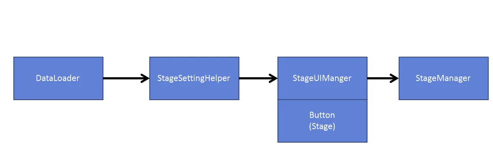

# 🛠 [박경택] 트러블슈팅: 커스텀 맵 데이터 로드 및 구조 분리

## 💡 문제 상황

### 1. 데이터 단일 처리 문제
- `Resources.Load<TextAsset>()`를 사용하여 JSON 데이터를 하나만 불러오는 방식 사용.
- 그러나 커스텀 맵은 여러 개 존재하므로, 하나만 불러오는 방식으로는 **모든 데이터를 로드할 수 없음**.

### 2. 구조 꼬임 & 단일 책임 원칙 위배
- `StageUIManager` 클래스가 **맵 셋팅과 UI 버튼 관리까지 동시에 수행**.
- 협업 시 메서드 탐색이 어려워지고, UIManager라는 명칭과 맞지 않게 **다중 책임**을 가지게 됨.

---

## 🧪 시도한 해결책

### ✅ JSON 데이터 다중 로드 처리

```csharp
TextAsset[] jsons = Resources.LoadAll<TextAsset>("Json/StageData");
for (int i = 0; i < jsons.Length; i++)
{
    StageData data = JsonUtility.FromJson<StageData>(jsons[i].ToString());
    datas.Add(data);
}
```

- `Resources.LoadAll()`로 폴더 내 모든 JSON 파일을 로드하여 리스트에 저장.
- 각 데이터를 Dictionary에 캐싱하여 빠르게 접근 가능.

---

### ✅ 구조 분리 (단일 책임 원칙 적용)

- `StageSettingHelper` 클래스를 새로 생성하여 다음 기능을 전담:
  - JSON 로딩 및 파싱
  - 프리팹 로딩 및 인스턴스화
  - `onCompleted` 이벤트 발행
- `StageUIManager`는 **UI 처리만 담당**하도록 역할을 축소하여 협업 충돌 최소화

---

### 📷 구조 분리 이미지



---

## ✅ 최종 구조 및 결과

### 클래스별 책임

| 클래스              | 역할 설명                                      |
|---------------------|------------------------------------------------|
| StageSettingHelper  | JSON 데이터 로딩, 프리팹 인스턴스화, 맵 셋팅   |
| StageUIManager      | 버튼 클릭 이벤트 처리, UI 인터랙션 관리       |
| StageManager        | 현재 스테이지 상태 및 게임 흐름 전반 관리     |

### 샘플 코드

```csharp
public void FindmapIndex(int stage)
{
    SettingMap(dataManager.GetStageData(stage));
}
```

- 선택한 스테이지에 대한 데이터를 가져와 맵을 생성하는 핵심 로직

---

## 🔍 정리

| 항목            | 개선 전                         | 개선 후                                |
|-----------------|----------------------------------|-----------------------------------------|
| 데이터 로드     | `Resources.Load` (단일)         | `Resources.LoadAll` (다중)             |
| 책임 분리       | UI와 맵 생성 혼합               | Helper 클래스에서 맵 전담              |
| 협업 난이도     | 메서드 탐색 어려움              | 클래스별 역할 명확화                   |

---
